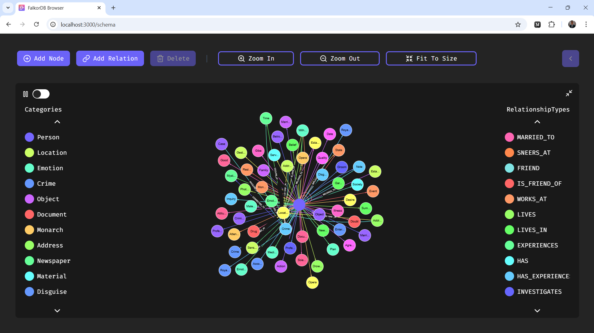

# ML Engineer Assignment

This project was developed by **Parsa Fathi** as part of an ML Engineering assignment. It utilizes two key projects, **GraphRAG-SDK** and **Unstructured-IO**, to process unstructured PDF files, extract their content, and generate a **knowledge graph** using **FalkorDB**.

## Installation

There are two ways to use this program:

1. **Cloning this repository** and running the code manually.
2. **Using Docker** for a containerized environment.

## Using Docker

### Prerequisites

- Set up **FalkorDB** by following the instructions [here](https://github.com/FalkorDB/FalkorDB).
- Ensure a **Docker Network** is created to allow communication between the program and the database.

### Steps

1. Pull the Docker image from Docker Hub:

   ```bash
   docker pull fathiparsa/graphrag
   ```

2. Choose a **local directory** to store your PDF files and the **GEMINI API key** for interaction.

3. Place your API key in the `settings.env` file inside your chosen directory.

4. Add your PDF files to the same directory for training a **new knowledge graph** or updating an **existing one**.

5. If updating an existing graph, include the `ontology.json` file in the same folder.

6. Run the following command to start the container:

   ```bash
   docker run -d -it --network {designated_network_name} \
     -v {your_local_directory}:/app/Resources \
     -p 6379:6379 \
     --name my_container \
     my_image /bin/bash
   ```

## Demo

### Training the Knowledge Graph


### Updating an Existing Graph



## Features

- **Train or Update Ontology**: Supports both generating new graphs and updating existing ones.
- **Cross-Platform Compatibility**: Works seamlessly across different operating systems.

## Optimizations

- **Parallel Computation**: Enhances performance by utilizing multi-threading.
- **Lightweight Base Image**: Uses **Linux** as the base image for improved efficiency compared to Windows.

## Description

Due to the performance limitations of the open-source version of **Unstructured-IO**, test files were processed using a simple **11-page storybook** for demonstration. Additionally, as a **free API** was used, smaller PDF sizes were preferred to ensure faster execution and avoid potential rate limits.

